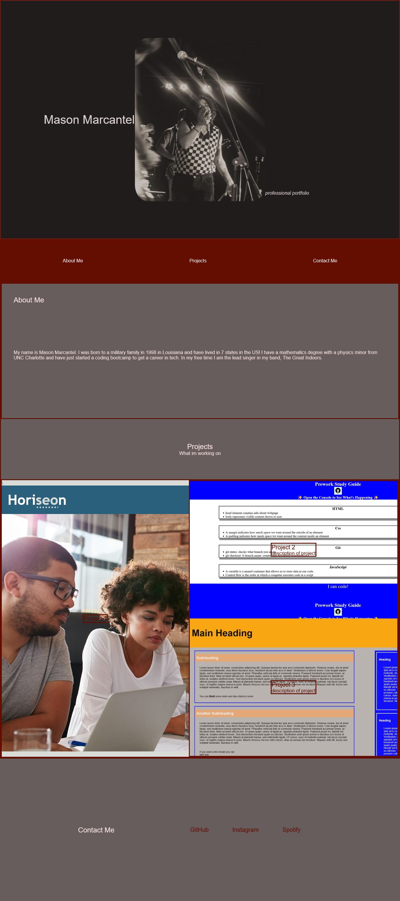

# Professional-Portfolio-Challenge
Advanced CSS Challenge: Professional Portfolio

# Table of Contents:
1. [Description](#description)
2. [Visuals](#visuals)
3. [Resources](#resources)

# Description:

This site is a professional portfolio made for Mason Marcantel by Mason Marcantel that displays an about me, and the projects that he is working on.

# Visuals:

# Resources:

[CSS Reset](https://meyerweb.com/eric/tools/css/reset/)

[CSS and HTML Tips](https://www.w3schools.com/)

[CSS EM Measurement](https://www.w3.org/Style/Examples/007/units.en.html)

[FlexBox Tips](https://css-tricks.com/snippets/css/a-guide-to-flexbox/)

[Responsiveness and the Media Query](https://www.w3schools.com/css/css_rwd_mediaqueries.asp)
